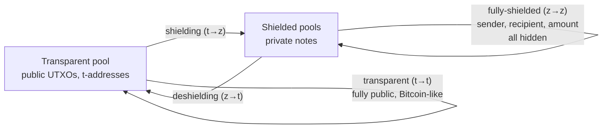
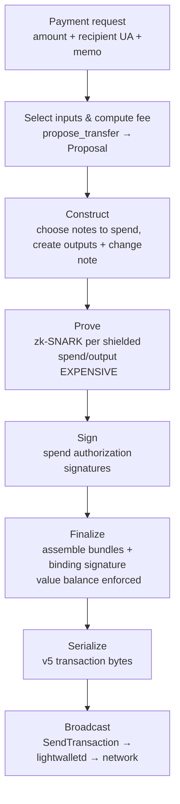
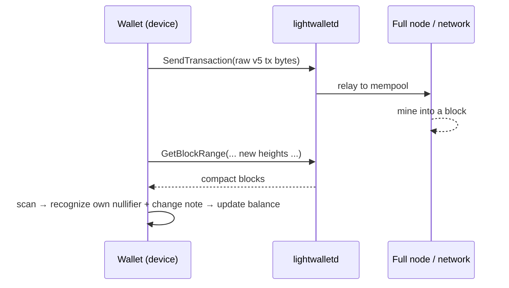
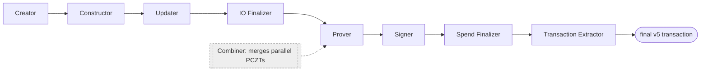
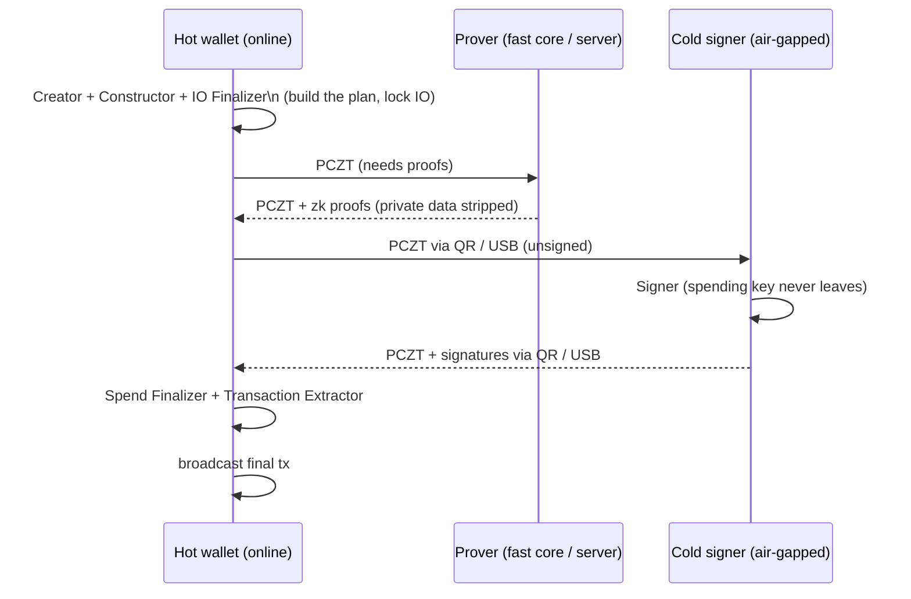
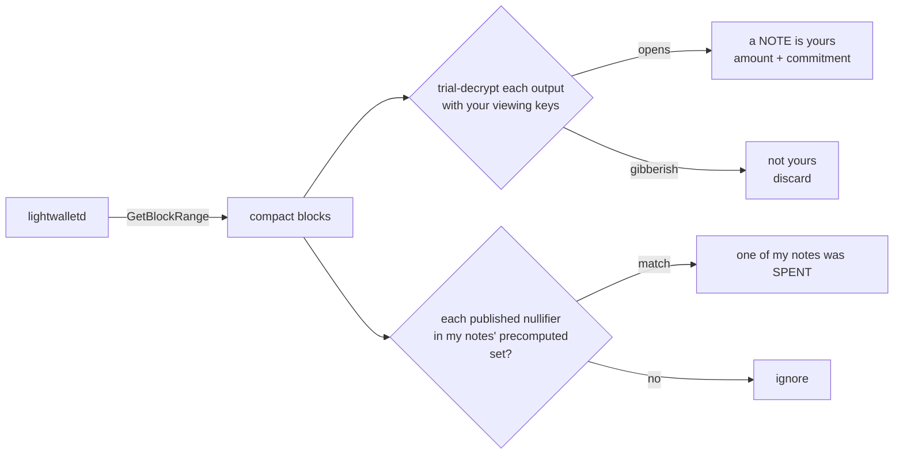
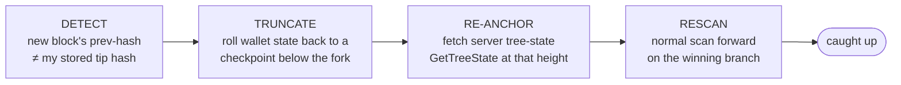

# ZEC for Mortals
### Zcash for mobile wallet developers — a canonical handbook, from app engineering to shielded-protocol fluency

> **Current as of:** network upgrade **NU6.2**, an emergency security hard fork activated on Zcash mainnet at block **3,364,600** on **3 June 2026**, consensus branch ID `0x5437f330`. NU6.2 re-enabled the Orchard pool with a corrected zero-knowledge proof circuit after a critical soundness bug was found by audit and responsibly disclosed — no exploitation occurred, and the turnstile confirmed total ZEC supply was intact (see §3.8 and [ZFND's write-up](https://zfnd.org/zebra-4-5-3-and-5-0-0-emergency-soft-fork-and-nu6-2-activation/)). The prior stable upgrade was **NU6.1** (block 3,146,400, 24 Nov 2025, branch `0x4DEC4DF0`). Further upgrades are in progress — including **NU7** ("Project Tachyon"), on testnet as of this writing ([z.cash/upgrade/nu7](https://z.cash/upgrade/nu7/)).
>
> **Compiled:** 1 July 2026.
>
> **Last reviewed by a protocol engineer:** _______________ _(pending — see "How this was made" below)_

---

## Who this is for

You ship wallet UIs and integrate SDKs. You are comfortable with UTXOs at a Bitcoin-101 level, with public-key crypto as a black box, with mobile app architecture, and with calling into native/FFI layers. You are *not* (yet) comfortable with shielded-pool mechanics, zero-knowledge proofs, or Zcash-specific vocabulary.

The goal is narrow and practical: get you to the point where you can **follow and contribute to a conversation with a protocol or blockchain engineer.** You will not leave here able to write cryptography or run a node — nor do you need to. You will leave able to reason about *why* a shielded wallet is built the way it is, what each moving part is for, and where the sharp edges live.

This handbook explains how things work **in general**, not how any one product's SDK is wired. Every new concept is introduced by analogy to something an app developer already knows, and every cryptographic operation is treated as an **honest black box** — we tell you what it guarantees and what it costs, never the math.

## How to read it

One chapter per sitting. Each opens with a one-paragraph summary and closes with a short **Check yourself** self-test — if you can answer those out loud, move on. Chapters 1–3 are foundations (the mental model and the vocabulary). Chapters 4–5 are the transaction and signing pipeline. Chapters 6–7 are where a mobile wallet actually lives: the native/FFI boundary and the daily friction of syncing a private chain on a phone. Chapter 8 is a glossary and a cite-by-number ZIP index for lookup.

## How this was made (provenance and trust)

This document was assembled by fetching and cross-checking **primary sources**: the [Zcash Improvement Proposals](https://zips.z.cash) (cited by number throughout), the [Zcash Protocol Specification](https://zips.z.cash/protocol/protocol.pdf), the [`pczt`](https://docs.rs/pczt) and [librustzcash](https://github.com/zcash/librustzcash) crate documentation, and the [lightwalletd light-client protocol](https://github.com/zcash/lightwallet-protocol). The sync-and-scan chapters additionally draw on a provided reference course, *"Zcash Sync Engines"* (an iOS-developer-focused learning book about one specific engine, **"Slipstream"**). Where that course describes an **implementation choice** rather than a universal Zcash rule, this handbook says so explicitly and cross-checks against librustzcash and the protocol before stating anything as general fact.

Two honesty notes, because they matter for a canonical document:

1. **This is AI-assisted and must be reviewed by a protocol engineer before it is treated as canonical.** The "Last reviewed" line above is intentionally blank. Every non-obvious claim is cited so a reviewer can trace it; where a fact could not be verified against a primary source, the text says so rather than guessing.
2. **Details shift per network upgrade.** This edition is stamped to NU6.1. When you read it, check whether a newer upgrade has landed (see the timeline in Chapter 8).

---

## Table of contents

1. [Orientation — Zcash as two worlds](#chapter-1--orientation--zcash-as-two-worlds)
2. [Addresses and value pools](#chapter-2--addresses-and-value-pools)
3. [The shielded-world vocabulary](#chapter-3--the-shielded-world-vocabulary)
4. [The life of a transaction — construction to broadcast](#chapter-4--the-life-of-a-transaction--construction-to-broadcast)
5. [Signing and PCZT — the separable pipeline](#chapter-5--signing-and-pczt--the-separable-pipeline)
6. [The SDK / FFI boundary, conceptually](#chapter-6--the-sdk--ffi-boundary-conceptually)
7. [Living with the chain — sync, witnesses, reorgs, confirmations](#chapter-7--living-with-the-chain--sync-witnesses-reorgs-confirmations)
8. [Glossary and ZIP index](#chapter-8--glossary-and-zip-index)

---

## Chapter 1 — Orientation — Zcash as two worlds

> **In one paragraph.** Zcash began as a fork of Bitcoin and kept Bitcoin's public, UTXO-based money as its "transparent" world. Bolted alongside it is a second, parallel world — the **shielded** world — where the same asset (ZEC) moves with the sender, recipient, and amount cryptographically hidden. A single Zcash wallet straddles both. The whole art of a Zcash wallet is that money in the shielded world is *encrypted so thoroughly that not even the server you download data from can find your transactions for you* — so the wallet must recognize its own money itself. That one constraint shapes every design decision in this book.

### 1.1 One coin, two worlds

Zcash (ZEC) is a cryptocurrency whose distinguishing feature is **optional privacy**. It was launched in 2016 from the Bitcoin codebase, so at its base it has exactly the model you already know: a public ledger of **UTXOs** (unspent transaction outputs), addresses, and transactions that anyone can inspect on a block explorer. In Zcash this is called the **transparent** world, and its addresses start with `t`. If you only ever used transparent Zcash, it would behave like a Bitcoin clone.

The interesting half is the **shielded** world: a parallel system, running on the very same chain, in which transactions reveal *nothing* publicly — not who sent, not who received, not how much. Shielded and transparent value are the same ZEC; they just live in different "pools" with different rules (Chapter 2 makes the pools precise).

Picture two ledgers sharing one book:

```
        ┌──────────────────────────────────────────────────────────┐
        │                    THE ZCASH BLOCK CHAIN                   │
        │  one public, append-only log — a new block every ~75 s     │
        ├───────────────────────────┬──────────────────────────────┤
        │      TRANSPARENT WORLD     │        SHIELDED WORLD         │
        │  (Bitcoin-style, public)   │   (parallel, private)         │
        │                            │                              │
        │  • UTXOs anyone can read   │  • "notes" only the owner     │
        │  • t-addresses (t1…, t3…)  │    can read                   │
        │  • amounts & parties       │  • sealed, encrypted outputs  │
        │    fully visible           │  • sender/recipient/amount    │
        │                            │    hidden from everyone       │
        └───────────────────────────┴──────────────────────────────┘
                     ▲                              ▲
             looks like Bitcoin            the reason Zcash exists
```

**Mental model to hold for the whole book:** Zcash is "Bitcoin, plus a parallel private world." Everything transparent behaves the way your Bitcoin intuition expects. Everything shielded is a new system you are about to learn — and it is where essentially all of the engineering difficulty (and all of the value) lives.

### 1.2 Moving between the worlds: shielding, deshielding, fully-shielded

Because value can sit in either world, there are three kinds of flows, and you should know the vocabulary because engineers use it constantly:

- **Shielding** — moving value from transparent into shielded (`t → z`). Think "depositing cash into a private account." A shielding transaction has visible transparent inputs and produces shielded outputs.
- **Deshielding** — moving value from shielded back out to transparent (`z → t`). The reverse; the exit is visible.
- **Fully-shielded** — value that starts shielded and stays shielded (`z → z`). Sender, recipient, and amount are all hidden. This is the privacy-preserving default the ecosystem encourages.



A privacy subtlety worth internalizing early: shielding and deshielding **expose the boundary**. The public side of a `t → z` or `z → t` transaction is visible, and the amounts crossing the boundary can be correlated. The same is true *between* shielded pools: a Sapling↔Orchard transfer is not fully private either, because the value moving from one pool to the other surfaces in each pool's public net balance (the `valueBalance` field). Only a *same-pool* shielded transfer — Sapling→Sapling or Orchard→Orchard — hides the amount completely. The strongest privacy therefore comes from value that lives its whole life inside one shielded pool. Your UI decisions (defaulting to shielded addresses, warning on transparent *and* cross-pool flows, keeping funds in Orchard) have real privacy consequences for users — which is why understanding the pools is not academic.

### 1.3 The wallet is (almost) nothing

Here is the first place a Zcash wallet departs hard from a bank app. Your wallet is essentially **just keys**, derived from a seed phrase. No balance is stored in those words; no server holds "your account." When a user restores a wallet from a seed, they are not downloading their money — they are *re-deriving keys* and then *rebuilding, from the public chain, the knowledge of what those keys own.*

In the transparent world that rebuild is easy: t-addresses are public, so a server can just tell you "these UTXOs belong to address `t1…`." In the shielded world it is the central problem of the entire system, because of the next point.

### 1.4 The twist that shapes everything

If Zcash were a normal backend, a wallet would call `GET /transactions?account=me` and render JSON. Shielded Zcash makes that **impossible by construction.** Shielded transactions are encrypted such that no observer — not miners, not the light-wallet server, not a block explorer — can tell who received money, who spent it, or how much moved. Every shielded output on the chain looks like random noise to everyone except the holder of the one key that opens it.

But privacy bills you for it: **if nobody can identify your transactions, then nobody can find them for you either.** There is no server-side "your transactions" query for shielded funds. The only way to learn what you own is to take shielded outputs published on the chain and *try your own key on each one.* The ones that open are yours; the rest teach you nothing — which is exactly the point.

> **The iOS analogy.** Imagine push notifications and server-side inboxes don't exist. Mail for everyone on Earth is dumped into one public firehose, every envelope locked. Your mail app's only strategy is to poll the whole firehose and try your key on every envelope. A Zcash wallet's shielded side is that mail app, engineered until "try every envelope ever" feels acceptable on a phone. Chapters 6–7 are about that engineering.

This is why a Zcash wallet is a real piece of systems software and not a thin API client. Hold that thought; it is the thread running through everything that follows.

### 1.5 What a wallet must therefore do

Everything a shielded wallet does can be grouped into four responsibilities. The *"Zcash Sync Engines"* course frames these memorably as **four jobs**, and they are a good scaffold for the whole book:

| The job | In one sentence | If you skip it… |
|---|---|---|
| **1. Read** | Fetch the chain's data from the wallet's "birthday" (creation height) to the current tip. | You're judging finances from a partial statement. |
| **2. Recognize** | Try your keys against shielded outputs to find money coming in, and watch for markers that mean your money went out. | Balance is wrong in both directions. |
| **3. Stay provable** | Maintain a running cryptographic summary of *all* shielded outputs ever, so that when you spend, you can prove your note exists without revealing which one. | You can *see* money but the Send button is a lie. |
| **4. Hold the truth** | Persist progress across crashes and restarts, and recover gracefully when the chain rewrites its recent history. | A routine chain hiccup corrupts the wallet. |

Balance is a side effect of jobs 1–2. Send needs job 3. Sanity needs job 4. If those four sentences make sense, you already understand the *shape* of a Zcash wallet; the rest of this book fills in the pieces — what the "keys" are (Chapter 3), how a spend is actually built and signed (Chapters 4–5), which side of the FFI boundary each job runs on (Chapter 6), and why jobs 1, 3, and 4 are genuinely hard on mobile (Chapter 7).

> _(Source for the "four jobs" framing: the provided "Zcash Sync Engines" course, ch. 1. The underlying facts — client-side recognition, tree maintenance for spendability, reorg recovery — are universal Zcash mechanics, corroborated in later chapters against librustzcash and the protocol spec.)_

### Check yourself

1. Why can't a light-wallet server just send your wallet its shielded transaction list, the way a normal backend would?
2. Name the three cross-world flows and say which one leaks the least information.
3. A user "restores" a wallet from a seed on a new phone. What actually happens — where does the balance come from?
4. Which of the four jobs makes the difference between *seeing* money and being able to *spend* it?

---

## Chapter 2 — Addresses and value pools

> **In one paragraph.** ZEC lives in one of several **value pools**, each with its own address type, keys, and rules: the **transparent** pool (public, Bitcoin-like) and the shielded pools **Sprout** (the original 2016 design, now legacy/closing), **Sapling** (2018), and **Orchard** (2022, the current shielded pool). Modern wallets present a single **Unified Address** ([ZIP 316](https://zips.z.cash/zip-0316)) that bundles receivers for several pools, and derive all their keys hierarchically from the seed ([ZIP 32](https://zips.z.cash/zip-0032)). Fees follow a simple per-"action" rule ([ZIP 317](https://zips.z.cash/zip-0317)). Knowing which pool a balance is in, and which pools an address can receive into, is day-one knowledge for wallet work.

### 2.1 The four value pools

A **value pool** is a distinct compartment of the ledger holding ZEC under one protocol's rules. Value doesn't automatically flow between pools; moving it takes an explicit transaction (a shielding/deshielding, or a cross-pool shielded transfer). There are four:

| Pool | Kind | Introduced | Address prefix | Status today (NU6.1) |
|---|---|---|---|---|
| **Transparent** | Public (UTXO) | 2016 launch | `t1` (P2PKH), `t3` (P2SH) | Fully supported; public, Bitcoin-like. |
| **Sprout** | Shielded (1st gen) | 2016 launch | `zc` | **Legacy / closing** — no new value can enter; migrate out. |
| **Sapling** | Shielded (2nd gen) | Sapling upgrade, block 419,200, Oct 2018 | `zs` | Supported; still holds real value. |
| **Orchard** | Shielded (3rd gen) | NU5, block 1,687,104, [31 May 2022](https://z.cash/upgrade/nu5/) | (Unified only, `u`) | **Current** shielded pool; most new shielded activity. |

A few things a wallet developer should take from this table:

- **Sprout is history.** It was the original shielded protocol (from the Zerocash paper) and has been a *closing* pool since February 2021 — no new ZEC can be sent into it ([ZIP 224](https://zips.z.cash/zip-0224) describes it as "a 'closing' shielded pool into which no new ZEC can be sent"). The version-5 transaction format ([ZIP 225](https://zips.z.cash/zip-0225)) dropped Sprout fields entirely, "as part of the continuing process of deprecation of the Sprout shielded pool." You will rarely touch Sprout; treat it as legacy context, and if a user still has Sprout funds, the only path is to migrate them out (Sprout → transparent or Sprout → Sapling, via the older v4 transaction format).
- **Sapling and Orchard are both live.** A wallet must handle *both*: a user may hold Sapling notes, Orchard notes, or a mix. They are separate systems with separate keys and separate cryptography (Chapter 3). Orchard is where new shielded activity is encouraged to go.
- **Pools are anonymity sets.** Each shielded pool forms "a separate anonymity set" ([ZIP 224](https://zips.z.cash/zip-0224)). More users transacting in the same pool means better privacy for each of them — a reason the ecosystem pushes everyone toward the current pool (Orchard) rather than fragmenting across old ones.

> **Turnstiles.** Zcash publishes, per pool, the net value entering and leaving it — a "turnstile" — so the total ZEC in each shielded pool is auditable even though individual balances are not. This is a monetary-integrity safeguard (it would catch a counterfeiting bug as an impossible pool balance), and it's why cross-boundary amounts are visible in aggregate. Good to know exists; rarely something a wallet UI surfaces. It is not hypothetical: during the June 2026 NU6.2 incident (§3.8), the turnstile was exactly what let the ecosystem confirm the total ZEC supply stayed intact while an Orchard circuit bug was being fixed.

### 2.2 Addresses, and why "which pool?" matters

Historically each pool had its own address format (`t1`/`t3` transparent, `zc` Sprout, `zs` Sapling). That created a real UX problem: a sender had to know which kind of address the recipient wanted, and a `zs` Sapling address could not receive Orchard funds. **Unified Addresses** solve this.

A **Unified Address (UA)**, defined in [ZIP 316](https://zips.z.cash/zip-0316), "combines one or more **Receivers**" into a single string starting with `u`. Each receiver is one pool's address, tagged by a **typecode**:

| Typecode | Receiver |
|---|---|
| `0x00` | Transparent P2PKH |
| `0x01` | Transparent P2SH |
| `0x02` | Sapling |
| `0x03` | Orchard |

The sender's wallet reads the UA, sees which receivers it contains, and **non-interactively picks a receiver to pay** — generally preferring the most private/modern pool both sides support (Orchard, then Sapling, then transparent). A UA must contain at least one shielded receiver, and there is intentionally **no** Sprout typecode (you cannot receive into a closing pool). UAs are encoded with **Bech32m** (chosen over Bech32 to handle variable-length input).

> **Receiver selection is a privacy decision, not just "newest wins."** A naive "always prefer the newest pool" rule can *hurt* privacy. Suppose the sender holds only **Sapling** notes and the recipient's UA offers both Orchard and Sapling: choosing the Orchard receiver forces a cross-pool Sapling→Orchard transfer, which (per §1.2) reveals the amount via the public `valueBalance`. A privacy-aware wallet instead **matches the sender's own funded pool** where it can — here, paying the Sapling receiver keeps it Sapling→Sapling and fully hidden. [ZIP 315](https://zips.z.cash/zip-0315) (wallet best practices) codifies related guidance — e.g. wallets *"MUST NOT automatically combine funds across pools,"* since that can reveal a user's holdings. So good selection depends on the *sender's* pool balances, not only the recipient's newest receiver.

```
u1qsj8v...        ← a Unified Address (mainnet prefix "u")
   │
   ├─ Orchard receiver   (typecode 0x03)   ← sender prefers this
   ├─ Sapling receiver   (typecode 0x02)   ← fallback
   └─ Transparent P2PKH  (typecode 0x00)   ← last resort, public
```

> **Why you care.** When you render "your address" in a wallet today, it should almost always be a UA. When you parse a recipient's address to build a payment, your SDK inspects the receivers and selects a target pool for you — but you'll see the consequences (which pool the change lands in, whether the payment is fully shielded) and you need the vocabulary to reason about them.

> **Version note / honest caveat.** The prefixes `u` (address), `uview` (Unified Full Viewing Key), and `uivk` (Unified Incoming Viewing Key) are ZIP 316 **Revision 0**, which is what production wallets use today. A later **Revision 2** (Draft, not active) proposes new prefixes to distinguish shielded-only from transparent-enabled UAs. Use `u`/`uview`/`uivk` now, but don't be surprised if a future edition of this handbook changes them. _(Older secondary docs such as the Zcash ReadTheDocs "Addresses" page predate Orchard and Unified Addresses and state, e.g., "3 value pools" and "Sapling has no viewing keys" — both stale. Prefer the ZIPs.)_

### 2.3 Keys and derivation (ZIP 32), and diversified addresses

All of a wallet's keys descend from the seed by **hierarchical deterministic (HD) derivation**, the shielded analogue of Bitcoin's BIP 32, specified in [ZIP 32 — *Shielded Hierarchical Deterministic Wallets*](https://zips.z.cash/zip-0032) (Status: Final). ZIP 32 now covers both Sapling and Orchard (Sprout derivation "has been removed since it was never used"). Keys are derived along a path `m / purpose' / coin_type' / account'` — note there is **no** `change` level as in Bitcoin, because shielded change is handled differently (Chapter 4).

The key hierarchy you must be able to name (full detail in Chapter 3):

```
seed (24 words)
  └── spending key            — can MOVE money (sign spends). The crown jewels.
        └── full viewing key  — can SEE all your activity (in + out), cannot spend.
              └── incoming viewing key — can only DETECT/DECRYPT incoming notes.
```

**Diversified addresses.** One more ZIP 32 feature with direct UX impact: a wallet can cheaply generate *many* unlinkable addresses that all share the same spending authority. ZIP 32 puts it well: "creating as many unlinkable addresses as needed does not increase the cost of scanning the block chain for relevant transactions." So giving every invoice or contact a fresh address (so observers can't link them) costs the wallet nothing at scan time — because they all resolve to the same viewing key.

### 2.4 Fees (ZIP 317), briefly but concretely

Fees follow [ZIP 317 — *Proportional Transfer Fee Mechanism*](https://zips.z.cash/zip-0317) (Status: Active). You don't need the derivation, but three numbers and one formula will let you follow any fee conversation:

- The fee is charged per **logical action** — roughly, per input or output across the pools (each Orchard action, each Sapling spend/output, and bundles of transparent ins/outs count).
- `marginal_fee = 5000` zatoshis per logical action. (1 ZEC = 100,000,000 zatoshis.)
- `grace_actions = 2` — the first two actions are "free" of marginal fee.
- **`conventional_fee = marginal_fee × max(grace_actions, logical_actions)`**

So a small transaction (a couple of actions) pays `5000 × 2 = 10,000` zatoshis = **0.0001 ZEC**. A larger transaction with more inputs/outputs pays proportionally more. ZIP 317 obsoletes the old flat 1000-zatoshi fee (ZIP 313), and it is a *wallet* standard: "It is not a consensus requirement that fees follow this formula; however, wallets SHOULD create transactions that pay this fee." Your SDK computes this during input selection (Chapter 4); the practical upshot is that consolidating many small notes costs more in fees, which affects how you word "send max" and coin-control features.

### 2.5 Memos

Shielded outputs can carry a **memo**: a fixed **512-byte** field travelling *inside* the encrypted note, visible only to the recipient (Protocol Specification §5.5; interpretation refined by the draft [ZIP 302](https://zips.z.cash/zip-0302)). It is the private "note/description" field users expect. Because it lives in the ciphertext, the memo is never public — but it is only present on *shielded* outputs, so a memo cannot accompany a purely transparent payment.

### 2.6 Transparent-exclusive (TEX) addresses — ZIP 320

A **TEX address** (`tex1…`, [ZIP 320](https://zips.z.cash/zip-0320)) is cryptographically just an ordinary transparent P2PKH address, but its encoding carries a directive: **only pay it from transparent funds.** A ZIP-320-aware wallet that sees a `tex1…` recipient will not spend shielded notes straight to it — it first deshields to a transparent address it controls, then pays from there.

The reason is exchange compatibility, not user privacy. Some exchanges (the motivating case was Binance, in 2023) must be able to identify and, if necessary, *return* a deposit to its source address — impossible if the funds arrive directly from a shielded pool. A TEX address guarantees a transparent, refundable source. The user's own privacy gain is marginal (the amount is visible on both hops), so treat TEX as a *compliance* affordance. Compliant wallets route the send through a **fresh, one-shot ephemeral transparent address** derived from the seed (on its own derivation branch) rather than reusing the main t-address, which removes address-reuse correlation (though not amount correlation). Note the protocol does **not** enforce TEX semantics — honoring the directive is the sending wallet's responsibility.

### 2.7 Payment request URIs — ZIP 321

[ZIP 321](https://zips.z.cash/zip-0321) defines a standard `zcash:` payment URI — the analogue of Bitcoin's BIP-21 `bitcoin:` links — so a link or QR code can open a pre-filled send screen:

```
zcash:u1address...?amount=1.5&memo=<base64url>&label=Coffee&message=Thanks
```

Core parameters are `address`, `amount`, `label`, `message`, and `memo` (base64url-encoded, since memos are binary). The format also supports **multiple payments** in a single URI via indexed parameters, and works with Unified Addresses or with individual receivers. This is the standard to implement for deep links, QR scanning, and "request payment" flows.

> **On the horizon — read as forward-looking, not current fact.** The light-client protocol definitions have begun to reference a *third* shielded pool, provisionally called **"Ironwood"** (it appears as `PoolType.IRONWOOD` in the current [lightwallet-protocol](https://github.com/zcash/lightwallet-protocol) definitions). As of this NU6.2 edition, Orchard remains the current shielded pool and Ironwood is not yet active on mainnet; a near-term upgrade (**NU6.3**) is slated to introduce it, and a later revision of this handbook will cover it properly. For now, treat Orchard as the current shielded pool and note Ironwood only as something a protocol engineer may raise.

### Check yourself

1. Name the four value pools and say which one is closing and which is current.
2. What is a Unified Address, and how does a sender decide which pool to pay when handed one?
3. Why does giving every contact a fresh diversified address cost the wallet nothing at scan time?
4. A user sends a minimal shielded payment. Roughly what fee do they pay, and per what unit is it charged?
5. Where does a memo live, who can read it, and why can't a transparent-only payment carry one?
6. What does a `tex1…` (TEX) address tell a sending wallet to do, and who is that feature actually for?
7. A sender holds only Sapling notes; the recipient's UA offers Orchard and Sapling. Which receiver should a privacy-aware wallet pay, and why?

---

## Chapter 3 — The shielded-world vocabulary

> **In one paragraph.** This is the glossary that makes every later chapter readable. Shielded value is held in **notes** (the shielded world's "banknotes" or UTXOs). Creating a note publishes a **note commitment** — a hash — which is appended to a global **note commitment tree**. To spend a note you prove it exists in that tree, referencing a past tree root called an **anchor**, using a small proof-of-membership called a **witness**. Spending publishes a **nullifier** — a one-time serial number that prevents double-spends without revealing which note was spent. Who can do what is governed by a hierarchy of **keys** (spending → full viewing → incoming viewing), presented to wallets as a **UFVK**. And the magic that ties it together — proving all of this while revealing none of it — is a **zk-SNARK**, which we treat strictly as a black box.

Read this chapter slowly; the rest of the book is an elaboration of these ten terms.

### 3.1 Notes — the banknotes of the shielded world

A **note** is a discrete unit of shielded value. The Protocol Specification (§1.2) puts it plainly: "Value in a shielded chain value pool is carried by notes, which specify an amount and (indirectly) a shielded payment address." Conceptually a note bundles three things: an **amount**, a **recipient** (a shielded address, encoded via key material — not a plaintext address), and some **randomness** that makes the note's on-chain fingerprint unique and hiding.

The single most important consequence for your mental model: **a shielded balance is a pocketful of discrete notes, not one running number.** Like physical banknotes, notes are indivisible — you cannot spend "part of" a note. To pay 7 from a 10-note, you consume the whole 10 and receive a fresh 3-note in **change** (Chapter 4). This is exactly the UTXO model you know from Bitcoin, just with the notes encrypted.

> **The iOS analogy.** A note is a `struct Note { let value: Zatoshi; let recipient: …; let rseed: … }` that you never get to see on the wire — you only ever reconstruct it locally after your key successfully opens the sealed output that carried it.

### 3.2 Note commitment — the public hash of a private note

When a note is created, the note itself is *not* published. Instead the chain publishes a **note commitment**: a hash that commits to the note's contents. Per the spec (§3.2.2): "only a commitment … to the note contents is disclosed publically … This allows the value and recipient to be kept private, while the commitment is used by the zk-SNARK proof when the note is spent, to check that it exists on the block chain."

So the commitment is the public, opaque "this note exists" token. It reveals nothing about amount or recipient (you cannot reconstruct a note from its commitment), but it is the durable on-chain anchor for the note's existence.

### 3.3 The note commitment tree — one global append-only structure

Every note commitment ever created is appended, **in exact chain order**, to a single global **note commitment tree** — an *incremental Merkle tree of fixed depth* (spec §3.8). "Incremental" means it only ever grows on the right; "Merkle tree" means every leaf is hashed together, pair by pair, up to a single root that fingerprints the entire set.

Crucially (spec §3.8): the tree "is not the job of this tree to protect against double-spending, as it is append-only." Its one job is to let you later prove *"my note's commitment is in here"* — the existence-and-therefore-spendability claim.

There are **separate trees per shielded pool** — a Sapling tree and an Orchard tree, growing in parallel — because the pools use different cryptography. A Sapling note's commitment goes in the Sapling tree; an Orchard note's in the Orchard tree.

```
             root  ← fingerprint of ALL commitments so far (changes on every append)
            /    \
          /        \
        •            •
       / \          / \
     cA  cB       cC  cD  cE  …  → new commitments append here (the "frontier")
     ▲
   your note's leaf
```

The trees are deep: **32 levels** for both Sapling and Orchard (Sprout used 29). At 32 levels the tree has room for over four billion notes. _(The depth constants `MerkleDepth^{Sapling} = 32` and `MerkleDepth^{Orchard} = 32` are defined in Protocol Spec §5.3 and are directly visible in the reference implementations, e.g. [`orchard/src/constants.rs`](https://github.com/zcash/orchard) `MERKLE_DEPTH_ORCHARD = 32` and [`sapling-crypto`](https://github.com/zcash/sapling-crypto) `NOTE_COMMITMENT_TREE_DEPTH = 32`.)_

### 3.4 Anchor — a snapshot (root) of the tree

An **anchor** is "a Merkle tree root of a note commitment tree … It uniquely identifies a note commitment tree state" (spec §3.4). Because the tree changes with every appended commitment, each block effectively has a tree root; an anchor is one such root, at some height.

When you build a spend, the transaction **references an anchor** — conventionally a recent root, though any valid one works — to say "I am proving membership against *this* snapshot of history." A Sapling Spend "specifies an anchor, which refers to the output Sapling treestate of a previous block" (spec §3.6); Orchard's `anchorOrchard` "MUST refer to some earlier block's final Orchard treestate" (spec §3.7). Note the phrase *"some earlier block"*: **anchors don't expire.** Consensus accepts any root that was ever an earlier block's final treestate, so old anchors stay valid indefinitely — some wallets deliberately reference an older anchor to spend a note without having scanned every later block. An anchor is rejected only if it was **never** part of the active chain: for example, a root that existed only on a branch that a reorg orphaned. That reorg case is the one that matters enormously in Chapter 7.

> **The iOS analogy.** An anchor is a content hash of an immutable snapshot — like a git commit SHA for the entire set of shielded notes as of some block. Your spend proof says "relative to snapshot `0xf3a…`, my note is present."

### 3.5 Witness — the proof-of-membership you must keep fresh

To prove your note is in the tree under a given anchor, you supply a **witness** (also called an authentication path): the handful of sibling hashes — one per level — that, combined with your leaf, let a verifier recompute the root without seeing any other leaf. In Zcash's own reference code this is called an **incremental witness**, built from the tree's "frontier" at the moment your note is appended and then updated as the tree grows.

Here is the brutal part, and the reason mobile Zcash is hard: **a witness must be maintained as the tree grows.** Every new commitment appended anywhere can change a sibling on your path, so the wallet updates each witness incrementally, block by block. Miss a block's commitments and that update is corrupted: the witness no longer corresponds to the real tree, so it can no longer produce a Merkle path that hashes to *any* valid root — and the spend proof fails, not subtly but entirely. (This is a *witness* failure, not an anchor one: valid old anchors are still accepted per §3.4; what breaks is your ability to prove membership against them.) So the wallet must keep every unspent note's witness **current** as new blocks arrive, which means it must process *every* block's commitments, not just its own. (Chapter 7 is largely about surviving this.)

> **The iOS analogy.** Think of a cached "path to root" you stored for a tree view. Every insertion elsewhere in the tree can invalidate part of your cached path; you must recompute the affected segments or your next traversal is wrong. The witness is exactly that cached path — at blockchain scale, with cryptographic consequences if it's stale.

### 3.6 Nullifier — the serial number that reveals nothing

Every money system must stop the same coin being spent twice. Bitcoin does it in the open (everyone sees UTXO #X consumed). Zcash can't — public coin identities are the deanonymization it exists to prevent. The **nullifier** squares the circle.

The spec (§3.2.3, §1.2) gives four black-box properties:

1. **Deterministic.** "The nullifier for a note … is a value unique to the note." Same note → same nullifier, always.
2. **Owner-only.** "Computing the nullifier requires the associated private spending key (or the nullifier deriving key)… It is infeasible to correlate the note commitment or note position with the corresponding nullifier without knowledge of at least this key." From outside it's just an opaque random-looking value.
3. **Published on spend.** Spending a note puts its nullifier on-chain (alongside a zero-knowledge proof that you were entitled to spend *some* valid note, without saying which).
4. **Globally tracked.** Consensus keeps the set of all nullifiers ever seen; "A transaction is not valid if it would have added a nullifier … that already exists in the set."

That one rule is the entire double-spend defense: spend a note twice and the second transaction republishes the same nullifier → already in the set → rejected. Meanwhile no observer can link the nullifier back to the note's commitment without the key.

And it hands your wallet the tool for the "money went out" half of job 2: because your wallet holds the keys to its own notes, it can **precompute the nullifier of every note it owns**, then watch every published nullifier. A match means one unambiguous thing — *one of my notes was just spent* — so it marks that note spent. You are the only party on Earth who can connect that value back to a specific coin.

> **Commitment ≠ nullifier.** These are two different objects for the same note. The commitment is created when the note is *born* and lives in the tree forever (the tree is append-only). The nullifier is published when the note *dies* and lives in the nullifier set forever. Spending never removes a leaf from the tree; it just adds a nullifier. New wallet developers conflate these constantly — don't.

> _(In Sprout/Zerocash, nullifiers were called "serial numbers" — you may see the older term in historical material.)_

### 3.7 The keys: spending, viewing, and the UFVK

Not all keys are equal, and the split is a security feature you will lean on in Chapters 5–6:

| Key | Can do | Cannot do | Where it should live |
|---|---|---|---|
| **Spending key** | Move money — authorize/sign spends. | — | The wallet app's secure storage; ideally a secure enclave. Never on a server. |
| **Full viewing key (FVK)** | See *all* activity — decrypt incoming **and** recognize outgoing notes; compute nullifiers. | Spend a cent. | Can be given to the scanning/sync component. |
| **Incoming viewing key (IVK)** | Detect and decrypt *incoming* notes only. | See outgoing activity; spend. | Even lower privilege; useful for receive-only scanning. |

The hierarchy is strictly one-way (spec §3.1): spending key → full viewing key → incoming viewing key. You can derive a viewing key from a spending key, never the reverse.

Under the hood, a full viewing key bundles the sub-keys that do these jobs: an **incoming viewing key** (`ivk`) for incoming notes, an **outgoing viewing key** (`ovk`) for recovering your *own* sends (what you sent and to whom), and a **nullifier-deriving key** (`nk`) that computes nullifiers. This is why an FVK can *detect* that your notes were spent yet still cannot *authorize* a spend — authorizing needs the spend authorizing key (`ask`), which only the spending key holds, not `nk`. (A useful nugget: a wallet can encrypt a payment with a random, immediately-discarded `ovk`, so that even a later holder of your FVK cannot recover which address that payment went to.)

For Unified Addresses, the viewing key is bundled into a **Unified Full Viewing Key (UFVK)** — encoded `uview…` — which combines the per-pool FVKs ([ZIP 316](https://zips.z.cash/zip-0316)). A wallet's sync engine typically imports **only a UFVK**: it can do all four jobs (read, recognize, stay provable, hold the truth) with viewing capability alone, and is *structurally incapable of stealing funds* because the spending key was never handed to it. This "the grinding, network-facing component holds viewing keys only" design is a property worth protecting in any wallet architecture. (The parallel Unified *Incoming* Viewing Key, `uivk…`, carries incoming capability only.)

### 3.8 zk-SNARK proofs — the black box, honestly labeled

Everything above needs one more ingredient: when you spend, you must convince the whole network that your spend is valid **without revealing which note you spent, its amount, or the parties.** That is the job of a **zk-SNARK** (zero-knowledge Succinct Non-interactive ARgument of Knowledge). We will not touch the math. Here is the honest black-box contract.

**What a shielded spend proof guarantees to any verifier** (spec §1.2, §3.2.3), while revealing none of the private details:

- You **know** a valid note whose commitment is present in the note commitment tree, **under the anchor the transaction references**.
- The note's **nullifier is correctly derived** (so the double-spend check is meaningful).
- **Value balances** — inputs equal outputs plus fee. (For Sapling and Orchard this balance is enforced *outside* the SNARK, via homomorphic value commitments and a "binding signature," but from your black-box view the net effect is "the transaction can't create or destroy value.")

The privacy heart of it (spec §1.2): "when a note is spent, the spender only proves that *some* commitment for it had been revealed, without revealing which one. This implies that a spent note cannot be linked to the transaction in which it was created."

**Two facts you must carry, both non-mathematical:**

1. **Generating a proof is expensive.** It is the costly, compute-heavy step of building a shielded transaction. As a sense of scale, Electric Coin Co. reported cutting shielded proving time "from Sprout's 37 seconds to Sapling's 2.3 seconds" — a huge improvement, but still a multi-second, per-spend cost that shaped how wallets (and the PCZT pipeline in Chapter 5) are built. Verifying a proof, by contrast, is cheap.
2. **The two live pools use different proving systems** — which is invisible to your UI but comes up constantly with engineers:

| Pool | Proving system | Trusted setup? |
|---|---|---|
| **Sapling** | Groth16 over the BLS12-381 curve | **Yes** — required a multi-party "trusted setup" ceremony (the Powers of Tau / Sapling MPC). If the secret "toxic waste" from that ceremony were ever reconstructed, forgery would be possible; the ceremony's many participants make that infeasible. |
| **Orchard** | Halo 2 (Pallas/Vesta curves) | **No** — Halo 2 needs no trusted setup, which is a major reason Orchard was built. ([ZIP 224](https://zips.z.cash/zip-0224): Orchard "uses the Halo 2 proving system … [and] does not require an SRS.") |

That's the whole black box: proofs are *what makes privacy and validity coexist*, they're *expensive to make and cheap to check*, and *Orchard removed the trusted setup that Sapling needed.* If you can say those three sentences, you can hold your end of a zk conversation.

> **When the black box leaks: the NU6.2 Orchard fix (June 2026).** A black box still has an implementation inside it, and implementations can have bugs. In May 2026 an independent auditor found a **soundness** bug in the Orchard Action circuit (in the `halo2_gadgets` crate): it could have let the Orchard pool accept invalid state transitions — i.e. double-spends *within Orchard* — though the **turnstile** (§2.1) still made inflating the total ZEC supply impossible. It was responsibly disclosed, and the network shipped a two-step fix with no known exploitation: an emergency **soft fork** (mainnet block 3,363,426) that temporarily disabled Orchard, then the **NU6.2** hard fork (block 3,364,600, 3 June 2026, branch `0x5437f330`) that re-enabled Orchard with the corrected circuit plus a new consensus rule rejecting malformed Orchard proofs. A hard fork was required because fixing a proof circuit means changing its pinned verifying key — something a software patch alone can't do. Takeaways for a wallet dev: "soundness" (the system accepts only valid transactions) is the exact property that bug threatened; the turnstile is the safety net that bounds the blast radius; and Sapling and transparent were unaffected because the flaw was specific to the Orchard circuit. Source: [ZFND, NU6.2 activation](https://zfnd.org/zebra-4-5-3-and-5-0-0-emergency-soft-fork-and-nu6-2-activation/).

### Check yourself

1. Your wallet's shielded balance is 8 ZEC. In what form is that 8 actually held, and why can't you send exactly 7 by "cutting" a note?
2. What is the difference between a note's **commitment** and its **nullifier** — when is each created, and where does each live forever?
3. A friend says "a witness is just your note's leaf value." Correct them in one sentence.
4. Why must the sync engine process blocks that contain *none* of your money?
5. You hand a sync component a UFVK but no spending key. Name one thing it can do and one thing it cannot — and why that's a security win.
6. In one sentence each: what does a shielded spend proof *prove*, and what does it *hide*? Which live pool needed a trusted setup and which did not?

---

## Chapter 4 — The life of a transaction — construction to broadcast

> **In one paragraph.** Building a shielded spend is a pipeline, not a single call. The wallet first **selects input notes** and computes fees, producing a **proposal**. From the proposal it **constructs** the transaction skeleton (which notes to spend, which outputs to create, including a **change** note back to yourself). It then **proves** each shielded spend/output (the expensive zk-SNARK step), **signs** to authorize the spend, and **finalizes** the assembled bundle — including a **binding signature** that enforces value balance. The result is a serialized transaction that gets **broadcast** to the network through the light-wallet server. Chapter 5 zooms into the prove/sign/finalize stages and why they're deliberately separable; this chapter is the end-to-end arc.

### 4.1 The stages, at a glance



Every shielded send walks this path. In librustzcash the first two stages are literally named: a `propose_transfer` call "selects inputs notes and computes the fees required to satisfy that request, and returns a `Proposal`," and a follow-up call then "construct[s], prove[s], and sign[s] a transaction … and persist[s] it" ([`zcash_client_backend::data_api::wallet`](https://docs.rs/zcash_client_backend/latest/zcash_client_backend/data_api/wallet/index.html)). You'll rarely call these directly, but knowing the proposal → creation split explains a lot of SDK surface.

### 4.2 Input selection and the proposal

Because a shielded balance is a set of discrete notes (Chapter 3), the wallet's first real decision is **which notes to spend.** This is coin selection, and it carries privacy and fee weight:

- It must gather enough note value to cover `amount + fee`.
- Each note it spends is one more logical action, so more inputs means a higher [ZIP 317](https://zips.z.cash/zip-0317) fee — the reason "consolidate dust" and "send maximum" behave the way they do.
- The pools matter: spending Sapling notes produces Sapling spends; spending Orchard notes produces Orchard actions. A payment may even cross pools (e.g. spend Sapling, output Orchard).

The output of this stage is a **proposal**: a fully-described plan (inputs, outputs, change, fees, target pools) that hasn't been built or signed yet. Separating "decide the plan" from "build the bytes" is useful — the plan can be inspected, displayed for confirmation, or (Chapter 5) shipped to another device.

### 4.3 Construction: notes die, outputs and change are born

Constructing the transaction turns the plan into concrete components:

- **Spends** — for each input note, a description that will carry the note's **nullifier** (marking it spent) and a zk-proof of its validity, referencing a recent **anchor**.
- **Outputs** — for each recipient, a new sealed shielded output carrying an encrypted note (amount + recipient + memo). This is exactly the "envelope" a *recipient's* wallet will later trial-decrypt.
- **Change** — almost always, one of the outputs is a note back to *yourself*, because notes are indivisible. Spend a 10-note to pay 7 and you mint a ~3-note of change (minus fee) addressed to your own wallet.

A worked example makes the simultaneity concrete. Suppose you hold a 10-note (Note A) and a 5-note (Note B), and you pay 7 to a recipient:

```
BEFORE                         ONE transaction                    AFTER
─────────                      ────────────────                   ─────────
Note A: 10  ─┐                 • publish nullifier(A)  → A spent   Note B: 5   (untouched)
Note B:  5   │  spend A only   • output 7  → recipient            Note C: 3   (your change)
             │                 • output 3  → yourself (change)
balance 15   ┘                 (fee omitted for clean arithmetic) balance 8   (5 + 3)
```

From the chain's vantage point, one transaction published *an opaque nullifier* and *two new note commitments* (yours-as-change and the recipient's). Only the respective key-holders can read their own output. Your wallet will later recognize Note C as change when it trial-decrypts that output with its own viewing key; the recipient's wallet recognizes the 7-note with theirs. _(This end-to-end "a coin dies, change is born, only key-holders can read it" walkthrough closely follows the "Zcash Sync Engines" course, ch. 12, and is consistent with the protocol's note/nullifier/commitment rules in Chapter 3.)_

### 4.4 Prove, sign, finalize

These three are the cryptographic heart, and Chapter 5 is devoted to *why they are separable*. In brief:

- **Prove.** For each shielded spend and output, generate the zk-SNARK proof (Chapter 3.8). This is the compute-heavy, multi-second-per-spend stage. It requires the note's private data but **not** the spending key.
- **Sign.** Produce the **spend authorization signature(s)** that actually authorize moving the value. This requires spend authority (the spending key / a randomized form of it), and it is cheap.
- **Finalize.** Assemble the Sapling and Orchard bundles and compute the **binding signature**, which cryptographically ties the whole bundle together and enforces that value balances (inputs = outputs + fee). Any transparent inputs get their `script_sig`s finalized here too.

The separation of "prove" (needs private note data, expensive, no spend authority) from "sign" (needs spend authority, cheap) is not incidental — it is what enables offloading proving and doing hardware/air-gapped signing. Hold that for Chapter 5.

### 4.5 Serialize and broadcast

The finalized transaction is serialized in the **version-5 format** ([ZIP 225](https://zips.z.cash/zip-0225), introduced at NU5), which carries Sapling and Orchard bundles (and no Sprout fields). Its transaction ID is computed by a non-malleable digest scheme ([ZIP 244](https://zips.z.cash/zip-0244)), so the txid is stable regardless of signature malleability — handy when your UI wants to track a pending send by ID.

Broadcast happens through the light-wallet server: the wallet calls the light-client `SendTransaction` RPC, and lightwalletd relays the raw transaction to its full node, which gossips it to the network ([lightwallet-protocol `service.proto`](https://github.com/zcash/lightwallet-protocol)). From there it's mempool → mined into a block → confirmations (Chapter 7). Note the asymmetry: *sending* is a single cheap RPC; *seeing* the resulting confirmation requires the wallet to scan the new block itself, because — as always — nobody can recognize your shielded outputs for you.



### 4.6 What this looks like from the SDK

You will typically experience the whole chapter as: *give the SDK a recipient, amount, and memo; get back a proposal to confirm; tell it to create-and-submit; then wait for sync to reflect the confirmation.* The proving happens inside the native core (Chapter 6). The reason to understand the internals anyway is that the failure modes surface at the boundaries — a spend can fail because its **anchor/witness went stale** (Chapter 7), a send can be underfunded because coin selection couldn't cover the **ZIP 317 fee**, or a hardware-wallet flow needs the **prove/sign split** from Chapter 5.

### Check yourself

1. Put the stages in order: sign, select inputs, prove, broadcast, finalize, construct. Which one is the expensive one?
2. Why does paying 7 from a single 10-note necessarily create a second output, and who is it addressed to?
3. From the public chain's point of view, what exactly does a fully-shielded spend publish?
4. Which stage enforces that a transaction can't create or destroy value?
5. Sending is one cheap RPC, but *seeing* your own confirmation is not free. Why?

---

## Chapter 5 — Signing and PCZT — the separable pipeline

> **In one paragraph.** A **PCZT** — *Partially Created Zcash Transaction* — is a portable, in-progress transaction that different entities can pass around and each add one thing to: structure, then proofs, then signatures, then finalization. It is Zcash's analogue of Bitcoin's **PSBT** ([BIP 174](https://github.com/bitcoin/bips/blob/master/bip-0174.mediawiki)), extended with the roles a shielded chain needs — most importantly a dedicated **Prover** role, because generating zk-SNARK proofs is a distinct, expensive stage that you often want to do *separately* from signing. Splitting a transaction into **construct → prove → sign → finalize** is what makes expensive proving offloadable and what makes hardware-wallet and air-gapped/QR signing possible at all. The canonical definition today is the [`pczt` Rust crate](https://docs.rs/pczt); the corresponding ZIP is still a draft.

### 5.1 Why a "partially created" transaction is even a thing

In a simple wallet, one process holds the keys, builds the transaction, proves it, signs it, and sends it — all in memory, all at once. That breaks down the moment you want any of these very common things:

- **Offload the expensive part.** Proving is multi-second and compute-heavy (Chapter 3.8). On a phone you may want to hand proving to a faster local core, or even prove on one device and sign on another.
- **Keep the spending key offline.** A hardware wallet or air-gapped device should sign *without* ever touching the network, the server, or the proving workload. That means the unsigned-but-otherwise-complete transaction has to be *serializable* and *transportable* (over USB, or as a QR code).
- **Split roles across parties.** Multi-party or multi-device flows need a common file format that each participant can add their piece to and pass along.

Bitcoin solved the same problem with **PSBT** (Partially Signed Bitcoin Transaction). PCZT is the Zcash counterpart. The crate says so directly: the PCZT format "enables splitting up the logical steps of creating a Zcash transaction across distinct entities. The entity roles roughly match those specified in [BIP 174] … and [BIP 370] …, with additional Zcash-specific roles" ([docs.rs/pczt](https://docs.rs/pczt/latest/pczt/)).

> **Naming, precisely.** The canonical expansion is **Partially _Created_ Zcash Transaction** (the crate's magic bytes are literally the ASCII `PCZT`). You will occasionally see "Partially Constructed" in informal writing; the primary sources use "Created." The acronym is the same either way.

### 5.2 The roles (the stage/role pipeline)

A PCZT moves through a sequence of **roles**. Each role is a narrow capability: it takes a PCZT in, adds exactly its contribution, and passes the PCZT on. A single program can play several roles, or roles can be split across devices. The following are the roles as defined in the [`pczt` crate](https://docs.rs/pczt/latest/pczt/roles/index.html) (v0.7.0 at time of writing); the one-line descriptions are the crate's own.

| Order | Role | What it does (per the crate) | PSBT analogue |
|---|---|---|---|
| 1 | **Creator** | "Creates the base PCZT with no information about spends or outputs." | Creator |
| 2 | **Constructor** | "Adds spends and outputs to the PCZT." | (Updater/Creator) |
| 3 | **IO Finalizer** | Locks the input/output set (`tx_modifiable` bits → 0) and updates the value-balancing key material. | *(no PSBT equivalent)* |
| — | **Updater** | "Adds information necessary for subsequent entities to proceed, such as key paths for signing spends." | Updater |
| 4 | **Prover** | "Needs all private information for a single spend or output" — generates the zk-SNARK proofs. | *(no PSBT equivalent — Zcash-specific)* |
| 5 | **Signer** | "Needs the spend authorization randomizers to create signatures." | Signer |
| 6 | **Spend Finalizer** | "Combines partial transparent signatures into `script_sig`s." | Input Finalizer |
| 7 | **Transaction Extractor** | "Creates bindingSig and extracts the final transaction." | Transaction Extractor |
| — | **Combiner** | "Combines several PCZTs that represent the same transaction into a single PCZT." | Combiner |

Two supporting roles also exist in the crate — **Redactor** (strips data later roles don't need) and **Verifier** (inspects without modifying) — plus a `low_level_signer` variant for constrained hardware. The typical ordered pipeline is:



> **Honest sourcing caveat.** The crate does not print one single "run A before B" list; the ordering above is synthesized from the crate's per-field "set by the Creator / Constructor / Prover / Signer" annotations and the draft ZIP's ordered role section (see §5.5), which agree. Treat the *sequence* as reliable and the exact module names (`creator`, `constructor` [role only, no module], `io_finalizer`, `updater`, `prover`, `signer`, `combiner`, `spend_finalizer`, `tx_extractor`) as verified against docs.rs.

### 5.3 How it mirrors — and extends — PSBT

If you already understand PSBT, most of PCZT is familiar. BIP 174 defines six roles — Creator, Updater, Signer, Combiner, Input Finalizer, Transaction Extractor — and PCZT keeps direct analogues of all of them (its **Spend Finalizer** is the counterpart of PSBT's **Input Finalizer**; both assemble transparent `script_sig`s). The draft PCZT spec even says its transparent handling "is taken directly from BIP 174 and BIP 370 … The rationale is that this makes integration of PCZTs simpler for codebases that already support PSBTs."

What PCZT **adds**, because a shielded chain needs it:

- **Prover** — there is no proving step in Bitcoin, so PSBT has no Prover. Zcash's expensive zk-SNARK generation gets its own role, so it can be isolated and offloaded (§5.4).
- **IO Finalizer** — computes the value-balance key material (the binding-signature key) once inputs/outputs are locked. Per the *draft PCZT specification* (not the crate docs), it also signs any *dummy* spends and clears their spending keys, so that "there is never a need for a Signer to parse spending key material from a PCZT" — a deliberate security property for hardware signers.
- **Redactor / Verifier** — housekeeping roles for trimming and inspecting.

```
PSBT (Bitcoin)        PCZT (Zcash)
──────────────        ─────────────────────────────
Creator          →    Creator
Updater          →    Updater
     —           →    Constructor  (adds shielded spends/outputs)
     —           →    IO Finalizer (locks IO, value-balance key)
     —           →    Prover       ★ the big addition: zk-SNARK proving
Signer           →    Signer
Input Finalizer  →    Spend Finalizer
Combiner         →    Combiner
Transaction      →    Transaction Extractor (+ binding signature)
  Extractor
```

### 5.4 Why splitting the stages matters (the whole point)

The payoff of all this structure is that **proving and signing become independent stages that can run in different places.**

**Expensive proving, isolated.** The Prover "needs all private information for a single spend or output" but not the spending key; the Signer needs spend authority but "sufficient information to verify that the proof is over the correct data, *without needing to verify the proof itself.*" So you can send a PCZT to a beefier prover, get it back with proofs attached and private data stripped, and only then sign — the signing device never bears the proving cost.

**Hardware-wallet and air-gapped/QR signing.** Because a PCZT is a serializable file (binary, `.pczt` extension), a fully-constructed-and-proven-but-unsigned transaction can be carried to an offline device — over USB or rendered as a QR code — signed there with the spending key that *never leaves* that device, and carried back for finalization and broadcast. The draft spec's abstract states the goal outright: "The signer can be offline as all necessary information can be provided in the transaction." The Signer role is deliberately kept minimal (a short list of primitives) precisely so it can run on constrained secure hardware.



This is why the pipeline exists in the shape it does: not academic tidiness, but the concrete needs of *offloading a heavy proof* and *keeping a spending key on an offline device.* When a protocol engineer says "we'll do it via PCZT," this is the capability they're invoking.

### 5.5 Status: crate is canonical, ZIP is still a draft

An important grounding point. The **normative definition of PCZT today is the `pczt` Rust crate** — the draft spec itself says "the schema for the encoding is canonically defined in the `pczt` Rust crate." The corresponding **ZIP 374** exists only as a *draft* (an open pull request, `draft-str4d-pczt.md`, with several sections still marked TODO); it is **not** a finalized, published ZIP. So:

- Cite the **`pczt` crate** (and, secondarily, the draft) for role names and behavior — which this chapter does.
- Do **not** present ZIP 374 as a ratified standard. When it is finalized and published at `zips.z.cash/zip-0374`, a future edition should re-cite it.
- One current limitation worth knowing: PCZT targets **v5 transactions only** — it does not build v4/Sapling-era-only or Sprout transactions.

### Check yourself

1. What problem does PCZT solve that a build-and-sign-in-one-process wallet cannot?
2. Which PCZT role has no equivalent in Bitcoin's PSBT, and why does Zcash need it?
3. Put these in pipeline order: Signer, Prover, Creator, Transaction Extractor, Constructor. Which two can run on entirely different devices, and what does each require?
4. What makes air-gapped signing possible — what property must the in-progress transaction have?
5. If someone cites "ZIP 374" as the authority for PCZT, what should you gently point out, and what is the canonical source instead?

---

## Chapter 6 — The SDK / FFI boundary, conceptually

> **In one paragraph.** Almost every mobile Zcash wallet is a thin native app wrapped around a shared **Rust core** — the [librustzcash](https://github.com/zcash/librustzcash) crates — reached through a **C/FFI boundary**. The Rust side does the cryptographically load-bearing, correctness-critical work: block scanning, trial decryption, note-commitment-tree and witness maintenance (via the [`shardtree`](https://docs.rs/shardtree) crate), fee calculation, transaction proposals, and proving. The native side (Swift on iOS, Kotlin on Android) does UI, key custody, orchestration, and networking. This chapter explains *why* that split exists and *what runs on which side*, generically — not any one product's API. It also introduces the server the wallet talks to (**lightwalletd**) and the newer stack replacing it.

### 6.1 Why wrap a Rust core at all

Recall Chapter 3.8: getting the cryptography wrong doesn't throw an exception — it silently produces a wrong tree, a bad witness, or an unspendable balance, and in the worst case a fund-losing bug. Nobody wants two independent re-implementations of that (one in Swift, one in Kotlin) drifting apart. So the ecosystem maintains **one** audited implementation of the hard parts, in Rust, and every wallet calls into it.

librustzcash is described as "a set of Rust crates for working with Zcash." The two you'll hear named most:

- **`zcash_client_backend`** — "A wallet framework for Zcash," providing "wallet data storage APIs; chain scanning; light client protocol support; fee calculation; transaction proposals & high-level transaction construction APIs" ([README](https://github.com/zcash/librustzcash)).
- **`zcash_client_sqlite`** — "SQLite-based implementation of `zcash_client_backend` storage APIs." The wallet's local database (notes, nullifiers, witnesses, scan progress) lives here.

Under those sit the cryptographic crates (`sapling-crypto`, `orchard`, `zcash_primitives`, the proving crates) and `shardtree`. The design principle, in the words of the *"Zcash Sync Engines"* course (ch. 8–9): the native app's job is "to call that brain correctly, not to duplicate it." Rolling your own key derivation, trial decryption, or tree hashing is how you introduce a class of vulnerabilities an audited library already spent years eliminating.

### 6.2 The boundary itself

Between native and Rust sits a **foreign-function-interface (FFI)** layer — a narrow C ABI. On Apple platforms this is commonly packaged as an `xcframework` distributed via Swift Package Manager (the FFI layer is described as the "Light Client FFI Layer for librustzcash"); on Android the same Rust core is reached over JNI. The exact packaging varies by product; the *shape* is universal.

```
┌───────────────────────────── your device ─────────────────────────────┐
│                                                                        │
│   NATIVE APP  (Swift / Kotlin)                                         │
│   • UI, navigation, state                                              │
│   • key custody (spending key in Keychain / secure enclave)           │
│   • orchestration: "start sync", "propose send", "confirm"            │
│   • often: networking (gRPC to the server)                            │
│                                                                        │
│  ══════════════════ C / FFI boundary (the only `unsafe`) ═════════════ │
│                                                                        │
│   RUST CORE  (librustzcash)                                            │
│   • block scanning + trial decryption                                 │
│   • note-commitment-tree + witness maintenance  (shardtree)           │
│   • nullifier tracking                                                 │
│   • fee calc, coin selection, transaction proposals                   │
│   • proving + transaction construction (PCZT roles)                   │
│   • local wallet DB (zcash_client_sqlite → SQLite)                    │
│                                                                        │
└────────────────────────────────────────────────────────────────────────┘
```

> **The iOS analogy.** It's the same pattern as wrapping a mature C library behind a clean Swift façade: you keep the `unsafe`/C-interop surface as small and well-audited as possible, and write everything above it in safe Swift. Here the "C library" happens to be safe Rust, and the *only* memory-unsafe code in the whole stack is the thin FFI shim. That's also exactly where a security review should concentrate.

### 6.3 What runs on which side, and why

The division isn't arbitrary — it follows the two invariants from earlier chapters (recognition must be client-side and private; the tree must be exactly right or spends fail):

| Concern | Side | Why |
|---|---|---|
| Trial decryption / scanning | **Rust core** | Cryptographic, hot-loop performance-critical, and must stay on-device for privacy (Chapter 7). |
| Note-commitment-tree + witnesses | **Rust core** (`shardtree`) | Correctness is cryptographically load-bearing; shared implementation avoids drift. |
| Fee calc, coin selection, proposals | **Rust core** | Encodes consensus/wallet rules (ZIP 317) that must not diverge across platforms. |
| Proving + tx construction | **Rust core** | Uses the audited proving crates; expensive and delicate. |
| Local wallet database | **Rust core** (`zcash_client_sqlite`) | Storage schema is coupled to the backend's invariants. |
| **Spending-key custody** | **Native** | Platform secure storage (Keychain / Keystore / secure enclave) is a native concern; keep the key out of the long-running network-facing core (Chapters 3.7, 5.4). |
| UI, orchestration, lifecycle | **Native** | It's an app. |
| Networking (gRPC to server) | **Either** | Some SDKs do gRPC in Rust, some in native and feed bytes across; both are valid. |

A subtle but important point for architecture discussions: the heavy, long-running, network-facing scanning component typically holds **only a viewing key (UFVK)** — the spending key stays on the native side and enters only for the brief signing step. So "which side holds the spending key" is a security decision, and the good answer is "not the sync core."

### 6.4 The server side: lightwalletd and its successors

A phone can't hold the whole chain, so it talks to a **light-client server**. The long-standing one is **lightwalletd**: it runs against a full node, strips each block to a **compact block** (Chapter 7), and serves ranges of them over gRPC. Its service is `CompactTxStreamer`, and the methods you'll hear about map cleanly onto the four jobs ([lightwallet-protocol `service.proto`](https://github.com/zcash/lightwallet-protocol)):

| RPC | Used for |
|---|---|
| `GetLatestBlock` | Find the chain tip. |
| `GetBlockRange` (streams `CompactBlock`) | Bulk-fetch compact blocks to scan (job 1). |
| `GetTreeState` / `GetLatestTreeState` | Fetch an authoritative note-commitment-tree snapshot at a height (seeds/repairs the local tree — jobs 3, 4). |
| `GetSubtreeRoots` (stream) | Fetch coarse subtree roots so a wallet needn't rebuild ancient tree interior from scratch. |
| `SendTransaction` | Broadcast a finished transaction (Chapter 4). |
| `GetTransaction` | Fetch a full transaction (e.g. to read a memo after a hit). |
| `GetTaddressTxids` / `GetTaddressTransactions` | Look up transparent-address activity (the transparent, public path). |

> **The stack is changing — forward-looking, sourced.** As of 2026 the reference full node is moving from **`zcashd`** to the Zcash Foundation's Rust node **Zebra (`zebrad`)** plus a new wallet backend **Zallet**; `zcashd` is being retired (and the still-testnet NU7 upgrade "will not be supported by zcashd"). On the indexer side, **Zaino** (by Zingo Labs) is a Rust indexer that "aims to replace lightwalletd" while implementing "all functionality currently in the LightWallet gRPC service (CompactTxStreamer)." The trio **Zebra + Zaino + Zallet** is referred to as the **"Z3 stack."** For a wallet developer the practical takeaway is: the *light-client protocol* (compact blocks over gRPC) is the stable contract; the *server implementation behind it* is being modernized, and you should target the protocol, not a particular server binary.

### 6.5 What this means when you're debugging

Because correctness-critical work is in the Rust core, most "wrong balance" or "can't send" bugs are *not* in your native code — they're in how you drove the core (wrong birthday height, didn't finish sync, fed it the wrong network) or in genuinely hard chain conditions (Chapter 7). The *"Zcash Sync Engines"* course (ch. 9) lists a few field-tested reflexes worth stealing: **stamp a build tag in your logs** (so you know which binary is actually running), **verify the seed first** when a balance looks wrong ("correct but empty" is indistinguishable from "buggy and empty" unless you check the seed), and **measure before optimizing** (the bottleneck is rarely where intuition points — see Chapter 7).

### Check yourself

1. Why do Zcash wallets share one Rust core instead of each platform implementing the crypto natively?
2. Name three responsibilities that belong on the Rust side and two that belong on the native side.
3. Where is the only memory-`unsafe` code in the stack, and why is that where a security reviewer should look first?
4. Which key should the long-running scanning core hold, and which should it never hold?
5. `zcashd` → ? and `lightwalletd` → ? Name the successors and say what stays stable for a wallet developer regardless.

---

## Chapter 7 — Living with the chain — sync, witnesses, reorgs, confirmations

> **In one paragraph.** This is where a mobile shielded wallet earns its keep. To know its balance and stay able to spend, the wallet must **scan** the chain: pull **compact blocks**, **trial-decrypt** every shielded output with its viewing keys, and — for *every* block, even ones with none of its money — keep the **note commitment tree** and its **witnesses** current. Because recent, spendable notes live near the tip, wallets scan **tip-first** (spend-before-sync). The chain occasionally **reorganizes** its recent blocks, which can invalidate anchors and witnesses, so the wallet must **detect, roll back to a checkpoint, re-anchor, and rescan.** On top of that sit real frictions: keeping witnesses current as the chain grows, hostile "spam" data, confirmation and spendable-balance nuances, and the fact that all this must run inside a phone's CPU and memory budget. Universal mechanics are marked as such; where a detail is one engine's *implementation choice*, this chapter says so.

### 7.1 Scanning: compact blocks and trial decryption

A full Zcash block is heavy — complete transactions, large zk-proofs, signatures, full ciphertexts. A phone can't download millions of those. So the light-client server ships **compact blocks**: each block stripped to only what a *viewing-key* wallet needs. The protocol's own comment says a compact block is "a packaging of ONLY the data … needed to: 1. Detect a payment to your Shielded address 2. Detect a spend of your Shielded notes 3. Update your witnesses … 4. Spend UTXOs associated to t-addresses" ([compact_formats.proto](https://github.com/zcash/lightwallet-protocol)).

Concretely, per shielded **output** the compact block keeps the ephemeral key, a short ciphertext **prefix**, and the note **commitment**; per shielded **spend** it keeps the **nullifier**. (For Sapling, `CompactSaplingOutput` is exactly `{cmu, ephemeralKey, 52-byte ciphertext prefix}` — 116 bytes total; `CompactOrchardAction` keeps `{nullifier, cmx, ephemeralKey, ciphertext}`.) Everything else — proofs, signatures, transparent scripts, the rest of the ciphertext — is dropped, because a recipient's viewing key never touches those.

**Recognition is trial decryption.** For every shielded output, the wallet combines its incoming viewing key with the output's ephemeral key to attempt decryption. It either **clicks open** (a well-formed note → "this is mine") or yields **gibberish** ("not mine — and I learned nothing about whose it is"). There is no index and no "to:" field; the only way to find your outputs is to try your key on every one.



**Why it can't be outsourced.** To let a server trial-decrypt for you, you'd have to give it your viewing key — which is exactly the thing that reads all your transactions. Hand it over and your full financial history is deanonymized on someone else's machine. So recognition is *intrinsically client-side*. This is the deep reason a Zcash wallet is real systems software, not a thin API client. _(Universal: this follows from the protocol's encryption design, Chapter 1.)_

> **Transparent addresses are the easy path.** Transparent funds have no privacy, so they need no trial decryption — the wallet just asks the server "any transactions touching this t-address?" (`GetTaddressTransactions`). Cheaper, blunter, and less private, which is why it's handled off to the side of the hot scanning loop.

### 7.2 The tree and witnesses: why no block can be skipped

Seeing a note (trial decryption succeeds) gives you a correct *balance*. Being able to *spend* it is a separate problem (Chapter 3): you need a current **witness** proving the note's commitment sits in the note commitment tree under a recent **anchor**. And here is the constraint that dominates mobile Zcash:

**Every block appends commitments to the tree, and every append can stale your witness — so the wallet must process every block, in order, even blocks with none of its money.** A block with 500 strangers' outputs still grows the tree by 500 leaves, some of which are siblings on your path. Skip it and your witness is silently wrong; the *next* spend fails at broadcast because the note's witness no longer matches the real tree (not because the anchor is "too old" — old anchors stay valid, §3.4). There is no "catch up later" — a skipped block is a corrupted witness.

This is why "boring" blocks aren't optional, and it's the single biggest reason a full restore is slow. It is also *universal*: the requirement comes from how spends must prove membership in the tree, not from any one engine. Zcash's reference stack implements the tree with the **`shardtree`** crate — "a space-efficient Merkle tree with witnessing of marked leaves, checkpointing & state restoration," represented as "an ordered collection of fixed-depth subtrees, or 'shards'." The server can supply coarse **subtree roots** (`GetSubtreeRoots`) so a wallet doesn't rebuild ancient interior nodes by hand.

### 7.3 Scan order: spend-before-sync

If a wallet scanned strictly birthday → tip, a user restoring a year-old wallet would stare at a wrong balance for the entire (possibly 50-minute) run, because their recent, spendable notes are near the *tip*, which linear scanning reaches last. So modern wallets scan **tip-first**: the database suggests a prioritized list of ranges, tip region first, and the engine works them in that order. Recent funds become spendable within the first minute or two; older history backfills afterward.

This "database suggests prioritized ranges" model is **universal librustzcash**, not one engine's trick: `zcash_client_backend`'s `WalletRead` trait defines `suggest_scan_ranges`, which "returns a vector of suggested scan ranges … in order of descending priority," and explicitly notes that the highest-priority `ScanPriority::Verify` ranges "must always be scanned first in order to avoid blockchain continuity errors in the case of a reorg" ([docs.rs](https://docs.rs/zcash_client_backend/latest/zcash_client_backend/data_api/trait.WalletRead.html)). What marketing calls "spend-before-sync" is this API in action.

Two consequences to bake into your UI:

- **Spendable ≠ 100% synced.** The wallet can be fully able to send while the progress bar sits at 3%, because the tip range finished first. Surface "funds ready" and "sync progress" as *separate* signals.
- **Non-linear order never means skipping blocks.** Within any range, every block is still scanned in order (§7.2). Prioritization reorders *regions*; it never deletes a block from a region's obligation.

> **Implementation choice, not canon.** *How* a range is broken into work units, how many blocks per commit, whether the tree is held in memory between flushes, and how progress percentage is computed are engine decisions. The *"Zcash Sync Engines"* course describes one valid approach (in-memory tree, batched commits, a fixed per-pass denominator to keep the progress bar monotonic); other engines choose differently. Treat these as design options, not Zcash rules.

### 7.4 Reorgs: when the chain changes its mind

The last few blocks of any blockchain are provisional. When two miners find a block at nearly the same height, the network briefly has two tips; whichever branch accumulates more work wins, and the loser's blocks are **orphaned**. From the wallet's view, a block it already scanned can cease to exist and be replaced by a different block at that height. This is a **reorg**.

For a shielded wallet a reorg is a quiet emergency, in two ways:

1. **Balance poison.** A note you "received" in an orphaned block was never really yours; if you don't roll it back, your balance shows money the network never confirmed.
2. **Tree/witness poison (the sharper edge).** The orphaned block's commitments occupied leaf positions in *your* local tree that the winning chain fills differently. From that point your tree diverges from the network's, every downstream witness is wrong, and **every future spend fails** even though the balance may look fine.

The defense is a fixed four-step cycle — and it is *universal* in shape, though depth caps and checkpoint cadence are tunable:



- **Detect** by the linked-list property: each block carries the previous block's hash. If an incoming block's previous-hash doesn't match your last stored block, something changed. (librustzcash surfaces exactly this as continuity/`Verify`-priority handling — §7.3.)
- **Truncate, don't recompute.** Roll wallet state back to a **checkpoint** (a saved tree snapshot) strictly below the fork point. This is a delete-above-height, not a reverse-engineered "undo" of cryptographic tree ops. `shardtree`'s built-in checkpointing is what makes this cheap.
- **Re-anchor** by fetching an authoritative tree snapshot from the server (`GetTreeState`) so you don't rebuild the tree from genesis.
- **Rescan** forward on the winning branch with the normal loop.

Depths matter: a 1-block reorg is routine; a 6-block reorg is rare; a 100-block reorg would require an adversary with enormous secret mining power. Wallets assume shallow reorgs are possible and cap recovery depth, declaring anything deeper a manual-resolution error.

> **A trap worth knowing (implementation-level).** Load-balanced server deployments run several nodes; if a request lands on one lagging a couple of blocks behind, it *looks* like a shallow reorg even though the chain didn't reorganize. A robust engine backs off and re-queries the tip before committing to a full truncation, and caps consecutive recovery cycles to avoid thrashing. This specific guardrail is an engine choice (described in the *"Zcash Sync Engines"* course, ch. 5), not a protocol rule — but the failure mode is real and worth designing for.

### 7.5 Confirmations and spendable balance

"Balance" in a shielded wallet is more nuanced than one number, and your UI has to represent the nuance honestly:

- **Confirmations.** A note is only as final as the block that created it. Wallets typically require a small number of confirmations before treating an incoming note as spendable (the common default is on the order of ~10 blocks, but the exact policy is a wallet/SDK setting — verify against your SDK rather than hard-coding an assumption). Fewer confirmations = more exposure to reorgs (§7.4).
- **Pending change locks value.** Right after you send, the note you spent is gone and your **change** note may not yet be confirmed — so spendable balance can briefly dip below total balance. This is normal, not a bug.
- **Spendable vs. total vs. synced.** At any moment a wallet may distinguish: *total* (all notes it knows about), *spendable* (confirmed, unspent, with current witnesses), and *sync progress* (how much history is scanned). These are three different truths; conflating them produces confusing UIs (a balance that looks spendable but isn't, or a "not synced" state that nonetheless can send — §7.3).
- **Expiry.** A built transaction has an expiry height ([ZIP 203](https://zips.z.cash/zip-0203)); if it isn't mined in time it can expire and the inputs become spendable again (the default is ~20 blocks). Long signing flows (Chapter 5) need to account for this.

### 7.6 Friction that's specific to mobile

Everything above has to run inside a phone's CPU, memory, and battery envelope, which creates frictions worth naming so you recognize them in the field:

- **Where the time actually goes.** The intuitive bottleneck — trial-decrypting tens of millions of outputs — is *not* the main cost. When one engine instrumented real syncs, decryption was only ~3–5% of scan time; the other ~95% was **persisting the commitment tree** to the local database. The universal lesson (measure, don't guess) holds regardless of engine; the specific fixes (hold the tree in memory during a scan, flush in big batches, overlap the next scan with the previous commit, parallelize fetch) are one engine's *implementation choices* that took an hour-plus restore under ten minutes on real devices. Other engines make other choices; the numbers are illustrative, not canonical.
- **The compute floor.** Once every core is pegged, the disk saturated, and the network fully used, more parallelism buys nothing — the only way to go faster is to do *less work* (e.g. a later wallet birthday, or future protocol help). Recognizing this "compute floor" keeps you from chasing speedups that don't exist.
- **Hostile data ("sandblasting").** In 2022 someone flooded Zcash with millions of tiny shielded outputs (heights ~1.70M–2.00M), making some blocks hundreds of times denser than normal. Engines that sized their work by *block count* choked — download timeouts, retry loops, out-of-memory kills. The durable fix is defensive engineering: **size work by bytes, not blocks; reset timeouts on real progress; resume retries from the last delivered height; bound in-flight memory.** These are general robustness principles; the exact byte budgets are per-engine tuning. This history is why a wallet can hit a wall in one region of the chain and why "restore is stuck at X%" bugs cluster there.

> **Reading the source correctly.** The provided *"Zcash Sync Engines"* course gives a rich, honest account of one engine's performance work, reorg handling, and spam mitigation. When it presents a concrete tactic — snapshot cadence, stream counts, chunk sizing, a byte-for-byte "golden oracle" test — read it as *"one team's valid approach,"* cross-checked here against librustzcash and the light-client protocol for the parts that are universal (compact blocks, trial decryption, the tree/witness requirement, `suggest_scan_ranges`, reorg-safe scan priority, `shardtree` checkpointing, `GetTreeState`/`GetSubtreeRoots`).

### 7.7 What the server can and cannot learn

Because the wallet talks to a server for data, it's worth being precise about the trust boundary — users and reviewers will ask.

**A light-client server cannot learn** (these are structural, not policy):

- Your **keys** — trial decryption is local; the viewing key is never sent.
- **Which outputs you decrypted** — success/failure produces no observable signal back to the server; the 99.99% misses and the rare hit look identical from outside.
- Your **balance** or **memo contents** — both are computable only from decrypted notes, which never leave the device.

It also **cannot forge** money you receive (shielded outputs need valid proofs) or silently corrupt you (a tampered block breaks the prev-hash continuity check and fails the sync loudly, leaving your state where it was). The precise phrase is **"denial, not theft"**: a hostile server can *withhold* data and stall you, but it cannot steal funds or make you accept coins that aren't yours.

**A light-client server can see** (all inherited from the light-client protocol design, not unique to any wallet): your **IP address and timing**, the **block ranges** you fetch (which reveals your approximate wallet birthday), the **tree-state heights** you request, the **txids** you fetch full details for, and — the one real named leak — your **transparent addresses**, which are queried in plaintext during transparent-address lookups. Mitigations are choosing a trusted server and routing over Tor; whether Tor is wired into a given wallet's fetch paths is an implementation detail to verify per product. _(This trust-boundary breakdown follows the "Zcash Sync Engines" course, ch. 8, and reflects the light-client protocol's known metadata exposure.)_

### Check yourself

1. What is in a compact block and what got thrown away — and why is dropping it neither a privacy nor a correctness problem?
2. A block contains 400 shielded outputs, none yours. Why is scanning it still mandatory?
3. Your wallet shows the right balance but Send fails at broadcast with a stale anchor. What almost certainly happened, and in which of the four jobs?
4. Walk the four steps of reorg recovery. Which step is a database delete rather than a cryptographic "undo"?
5. Right after sending, spendable balance dips below total balance. Bug or expected? Why?
6. Name two things a light-client server genuinely cannot learn about you, and the one real leak it does get.

---

## Chapter 8 — Glossary and ZIP index

A lookup chapter. Definitions are deliberately short; the chapter reference points to where the concept is developed.

### 8.1 Glossary

- **Action (Orchard).** The Orchard unit that combines a spend and an output in one object; counts toward the ZIP 317 fee. *(Ch. 2, 4)*
- **Anchor.** A root (snapshot) of a note commitment tree at some height, which a shielded spend references to prove membership. Anchors don't expire — any root that was ever a block's final treestate stays valid; an anchor is invalid only if its branch was orphaned by a reorg. *(Ch. 3.4, 7.4)*
- **Binding signature.** The signature over a shielded bundle that enforces value balance (inputs = outputs + fee); produced at finalization. *(Ch. 4.4)*
- **Birthday.** The block height at which a wallet's seed was created; scanning starts here, not at genesis. *(Ch. 1.5, 7.3)*
- **Compact block.** A block stripped by the light-client server to only what a viewing-key wallet needs (per output: ephemeral key, ciphertext prefix, commitment; per spend: nullifier). *(Ch. 7.1)*
- **Change note.** A new shielded note paid back to yourself because notes are indivisible. *(Ch. 3.1, 4.3)*
- **Deshielding.** Moving value from a shielded pool to the transparent pool (`z → t`); the exit is publicly visible. *(Ch. 1.2)*
- **Diversified address.** One of many unlinkable addresses sharing the same viewing key and spend authority; cheap to generate. *(Ch. 2.3)*
- **Full viewing key (FVK).** Sees all activity (incoming and outgoing) and computes nullifiers, but cannot spend. *(Ch. 3.7)*
- **FFI boundary.** The narrow C ABI between a wallet's native code and its Rust core; the only memory-`unsafe` surface. *(Ch. 6.2)*
- **Fully-shielded.** A transaction whose value starts and stays shielded (`z → z`); sender, recipient, amount all hidden. *(Ch. 1.2)*
- **Incoming viewing key (IVK).** Detects and decrypts incoming notes only. *(Ch. 3.7)*
- **lightwalletd.** The light-client server that runs a full node, produces compact blocks, and serves them over gRPC (`CompactTxStreamer`). Being succeeded by the "Z3 stack." *(Ch. 6.4)*
- **Logical action.** The ZIP 317 unit of fee accounting (roughly per input/output across pools). *(Ch. 2.4)*
- **Note.** A discrete unit of shielded value (amount + recipient + randomness); the shielded world's UTXO/banknote. *(Ch. 3.1)*
- **Note commitment.** The public hash of a note, appended to the note commitment tree; reveals nothing about the note. *(Ch. 3.2)*
- **Note commitment tree.** The global, append-only, fixed-depth (32 for Sapling/Orchard) incremental Merkle tree of all commitments; separate tree per pool. *(Ch. 3.3)*
- **Nullifier.** A note's unique, owner-derivable, one-time serial number, published on spend to prevent double-spends without revealing which note. *(Ch. 3.6)*
- **Outgoing viewing key (OVK).** A component of the full viewing key that lets you decrypt your *own outgoing* notes — what you sent and to which address. *(Ch. 3.7)*
- **Payment request URI (ZIP 321).** A `zcash:` link/QR that encodes a payment request (address, amount, memo, label); opens a pre-filled send screen. *(Ch. 2.7)*
- **PCZT.** Partially Created Zcash Transaction — a portable in-progress transaction passed through roles (Creator → … → Prover → Signer → … → Extractor); Zcash's PSBT analogue. *(Ch. 5)*
- **Pool (value pool).** A compartment of the ledger with its own rules/keys: transparent, Sprout (legacy), Sapling, Orchard. *(Ch. 2.1)*
- **Proposal.** A described-but-unbuilt transaction plan (inputs, outputs, change, fees) from the input-selection stage. *(Ch. 4.2)*
- **Prover (role) / proving.** The PCZT role and pipeline stage that generates zk-SNARK proofs; expensive; needs private note data but not the spending key. *(Ch. 3.8, 5.2)*
- **Reorg (reorganization).** The chain discarding recent blocks for a competing branch; can invalidate anchors/witnesses and requires rollback. *(Ch. 7.4)*
- **Shardtree.** The librustzcash crate implementing the note commitment tree as sharded subtrees with witnessing and checkpointing. *(Ch. 6.1, 7.2)*
- **Shielding.** Moving value from transparent into a shielded pool (`t → z`); the entry is visible. *(Ch. 1.2)*
- **Spend-before-sync.** Scanning tip-first (via `suggest_scan_ranges`) so recent funds become spendable before full history finishes. *(Ch. 7.3)*
- **Spending key.** The key that authorizes moving money; kept in native secure storage, never in the sync core or on a server. *(Ch. 3.7)*
- **TEX address (ZIP 320).** A `tex1…` transparent address that signals "pay me only from transparent funds," used for exchange-deposit compliance; compliant wallets route via a one-shot ephemeral t-address. *(Ch. 2.6)*
- **Trial decryption.** Attempting to decrypt every shielded output with your viewing keys to recognize your own notes; intrinsically client-side. *(Ch. 7.1)*
- **Turnstile.** The per-pool accounting of value entering/leaving a shielded pool, making pool totals auditable. *(Ch. 2.1)*
- **UFVK (Unified Full Viewing Key).** A ZIP 316 bundle of per-pool full viewing keys (`uview…`); what a sync engine typically imports. *(Ch. 3.7)*
- **Unified Address (UA).** A ZIP 316 address (`u…`) bundling receivers for several pools; the sender picks the best pool to pay. *(Ch. 2.2)*
- **Witness.** The per-note authentication path (sibling hashes) proving its commitment is in the tree under an anchor; must be kept current as the tree grows. *(Ch. 3.5, 7.2)*
- **zk-SNARK.** The zero-knowledge proof that a shielded spend is valid without revealing the note/amount/parties; expensive to make, cheap to verify. Sapling: Groth16 (trusted setup); Orchard: Halo 2 (no trusted setup). *(Ch. 3.8)*

### 8.2 ZIP index (cite by number)

Zcash Improvement Proposals are the primary standards. Fetch any at `https://zips.z.cash/zip-NNNN`.

| ZIP | Title | Status | Relevance |
|---|---|---|---|
| [32](https://zips.z.cash/zip-0032) | Shielded Hierarchical Deterministic Wallets | Final | Key derivation from seed; diversified addresses. *(Ch. 2.3)* |
| [203](https://zips.z.cash/zip-0203) | Transaction Expiry | Final | `nExpiryHeight` — a transaction can't be mined after its expiry block. *(Ch. 7.5)* |
| [224](https://zips.z.cash/zip-0224) | Orchard Shielded Protocol | Final | The current shielded pool; Halo 2, no trusted setup. *(Ch. 2, 3.8)* |
| [225](https://zips.z.cash/zip-0225) | Version 5 Transaction Format | Final | The v5 tx format (Sapling+Orchard bundles; no Sprout). *(Ch. 4.5)* |
| [244](https://zips.z.cash/zip-0244) | Transaction Identifier Non-Malleability | Final | Stable txid / signature digest scheme. *(Ch. 4.5)* |
| [253](https://zips.z.cash/zip-0253) | Deployment of NU6 | Final | NU6 activation (block 2,726,400, ~Nov 2024). *(Ch. 8.3)* |
| [255](https://zips.z.cash/zip-0255) | Deployment of NU6.1 | Proposed¹ | NU6.1 activation (block 3,146,400, 24 Nov 2025). *(Ch. 8.3)* |
| [302](https://zips.z.cash/zip-0302) | Standardized Memo Field Format | Draft | Memo interpretation (the 512-byte field itself is Protocol Spec §5.5). *(Ch. 2.5)* |
| [315](https://zips.z.cash/zip-0315) | Best Practices for Wallet Implementations | Draft | Wallet security/privacy guidance (pool handling, receiver selection, address rotation). *(Ch. 2.2)* |
| [316](https://zips.z.cash/zip-0316) | Unified Addresses and Unified Viewing Keys | Active (Rev 0) | UAs, receivers/typecodes, UFVK/UIVK. *(Ch. 2.2, 3.7)* |
| [317](https://zips.z.cash/zip-0317) | Proportional Transfer Fee Mechanism | Active | Fee rule: 5000 zat/action, 2 grace actions. Obsoletes ZIP 313. *(Ch. 2.4)* |
| [320](https://zips.z.cash/zip-0320) | TEX Addresses (transparent-source-only) | Active | `tex1…` addresses + ephemeral-address derivation for exchange deposits. *(Ch. 2.6)* |
| [321](https://zips.z.cash/zip-0321) | Payment Request URIs | Active | `zcash:` payment URIs — amount, memo, label; multi-payment support. *(Ch. 2.7)* |
| [374](https://github.com/zcash/zips/pull/1063) | Partially Created Zcash Transaction Format | **Draft²** | PCZT format. **Not yet a published ZIP** — the `pczt` crate is canonical. *(Ch. 5.5)* |

Cross-references outside the ZIP series: **BIP 32** (HD wallets), **BIP 174 / BIP 370** (PSBT / PSBT v2 — the model PCZT extends). *(Ch. 5.3)*

¹ ZIP 255's fetched header still reads "Proposed," but NU6.1 is confirmed activated on mainnet by [z.cash/upgrade/nu6-1](https://z.cash/upgrade/nu6-1/) — a stale status field, not a factual conflict. ² ZIP 374 is an open draft (PR #1063, `draft-str4d-pczt.md`) with sections still marked TODO; do not cite it as ratified. Dev-fund ZIPs bundled into NU6/NU6.1 (funding-model changes) are **out of scope** for this handbook by design.

### 8.3 Network upgrade timeline

Each network upgrade (NU) can change consensus rules, so this handbook is stamped to one. Heights/dates below are cited where verified this edition; earlier upgrades are widely documented — verify exact heights at `z.cash/upgrade/…` if precision matters.

| Upgrade | Height | When | Brought (relevant to wallets) |
|---|---|---|---|
| Sprout (launch) | genesis | Oct 2016 | Original transparent + Sprout shielded pool. |
| Overwinter | 347,500 | ~Jun 2018 | Versioned tx, replay protection. |
| **Sapling** | 419,200 | ~Oct 2018 | Efficient shielded pool (`zs`); mobile-feasible proving. |
| Blossom | 653,600 | ~Dec 2019 | Shorter block target. |
| Heartwood | 903,000 | ~Jul 2020 | Shielded coinbase. |
| Canopy | 1,046,400 | ~Nov 2020 | (Sprout became closing shortly after, Feb 2021.) |
| **NU5** | 1,687,104 | 31 May 2022 | **Orchard pool; v5 tx format; Halo 2; Unified Addresses.** |
| NU6 | 2,726,400 | ~Nov 2024 | Funding-model changes (out of scope here). |
| NU6.1 | 3,146,400 | 24 Nov 2025 | Funding-model changes. |
| **NU6.2** | 3,364,600 | 3 Jun 2026 | **Emergency security hard fork.** Re-enabled Orchard with a corrected zk-proof circuit after a soundness bug (branch `0x5437f330`; preceded by a soft fork at block 3,363,426 that briefly disabled Orchard). See §3.8. **← this edition is current as of here.** |
| NU6.3 | — | — | Anticipated near-term upgrade introducing a new shielded pool (**Ironwood**). To be covered in a later revision. |
| NU7 ("Tachyon") | — | testnet 22 May 2026; **no mainnet height yet** | Scaling of shielded throughput; will require Zebra (not `zcashd`). Forward-looking. |

### 8.4 Primary sources

- Zcash Improvement Proposals — https://zips.z.cash
- Zcash Protocol Specification — https://zips.z.cash/protocol/protocol.pdf
- `pczt` crate (canonical PCZT definition) — https://docs.rs/pczt
- librustzcash (`zcash_client_backend`, `zcash_client_sqlite`) — https://github.com/zcash/librustzcash
- `shardtree` crate — https://docs.rs/shardtree
- Light-client protocol (compact blocks, gRPC) — https://github.com/zcash/lightwallet-protocol
- Network upgrades — https://z.cash/upgrade/nu5/ · https://zips.z.cash/zip-0253 · https://z.cash/upgrade/nu6-1/ · NU6.2 (ZFND): https://zfnd.org/zebra-4-5-3-and-5-0-0-emergency-soft-fork-and-nu6-2-activation/ · https://z.cash/upgrade/nu7/
- BIP 174 (PSBT), the model for PCZT — https://github.com/bitcoin/bips/blob/master/bip-0174.mediawiki
- Provided reference: *"Zcash Sync Engines"* course (Slipstream) — used for the sync/scan chapters as one engine's approach, cross-checked against the above.

---

> ### ⚠ Review status
> This handbook is **AI-assembled from cited primary sources and one provided reference course, and has not yet been reviewed by a protocol engineer.** Before it is treated as canonical, a Zcash protocol/blockchain engineer should verify it once — with particular attention to: the PCZT role pipeline (§5.2, currently grounded in the `pczt` crate ahead of a finalized ZIP), the note-commitment-tree depth constants (§3.3), the NU6.2 Orchard-fix sidebar (§3.8) and forward-looking Ironwood / NU6.3 / NU7 notes (§2.5, §6.4), and the confirmation-count default (§7.5, deliberately left to the SDK). Record the review on the "Last reviewed by a protocol engineer" line at the top.
>
> _End of handbook. Current as of NU6.2 · compiled 1 July 2026._


